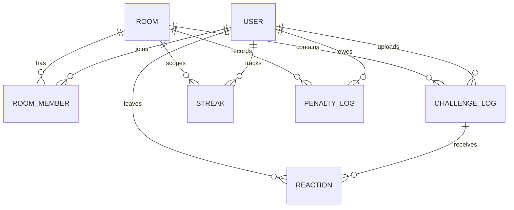

# FitBet (핏벳) PRD

> 소규모 지인 전용 운동 인증 & 벌금 배틀 웹 서비스
> 문서 상태: Draft v0.1 · 작성일: 2026-09-23 · 대상: MVP
> 원본: Notion `개발자 커리어 OS / 💼 프로젝트 / FitBet_PRD` (노션이 바뀌면 이 파일도 같이 갱신할 것)

---

## 1. 서비스 배경 및 핵심 목표

### 1.1 문제 정의
- 혼자 운동하면 의지가 부족하고 작심삼일이 됨.
- 기존 운동 앱은 개인 기록 중심이라 **사회적 압박(Peer Pressure)**과 **손실 회피 동기**가 약함.

### 1.2 해결 방안
- 친한 친구들끼리 방(Room)을 만들어 **1일 1회 운동 인증**을 진행.
- 미인증 시 **1회당 1,000원 벌금**을 가상 장부에 부과하는 도파민 기반 소규모 배틀 웹 서비스.

### 1.3 서비스 형태
- 모바일 브라우저에 최적화된 반응형 웹 (**Mobile-First, 390px 기준**)
- 별도 앱 설치 없이 초대 코드/링크로 즉시 참여

### 1.4 핵심 목표 (MVP 성공 지표)
| 지표 | 목표 |
|---|---|
| 방 참여자 일일 인증률 | 70% 이상 |
| 2주 이상 유지되는 방 비율 | 50% 이상 |
| 인증 업로드 소요 시간 | 30초 이내 (모달 오픈 → 제출) |

### 1.5 MVP 범위 밖 (Out of Scope)
- 실제 결제/송금(PG) 연동
- 푸시 알림(웹푸시), 소셜 로그인 → 후속 버전 검토
- 공개 방/랜덤 매칭 (지인 전용 서비스 원칙 유지)

---

## 2. 핵심 룰 및 도메인 정책

### 2.1 인증 마감
- 매일 밤 **23:59:59** 기준 (서버 타임존: `Asia/Seoul` 고정)

### 2.2 당일 통과 조건
- 방 참여자가 당일(00:00:00 ~ 23:59:59) 운동 인증 사진을 **1장 이상 업로드** 시 해당 날짜 통과.
- 같은 날 추가 업로드는 DB 제약으로 차단 (1일 1인증).

### 2.3 연속 달성 (Streak)
- 연속 성공 시 일수 카운트 +1.
- **하루라도 인증 실패 시 Streak은 즉시 0으로 초기화.**
- `maxStreak`은 최고 기록으로 유지 (초기화되지 않음).

### 2.4 벌금 및 정산
- 미인증 시 **1,000원 벌금 장부 레코드 자동 누적** (방 설정 `penaltyAmount` 기준).
- 외부 결제 PG 연동 없이 **가상 장부** 형태로 기록.
- 주간/시즌 종료 시 **"누가 누구에게 얼마 송금해야 하는지"** 텍스트 리포트 제공.

### 2.5 친구 상호 검증
- 업로드된 사진에 대해 친구들이 **'인정 👍' 또는 '의심 🤔' 리액션**을 남길 수 있는 피드 형태.
- 본인 인증 글에는 리액션 불가, 1인 1리액션(변경 가능).

### 2.6 정책 결정 필요 사항 (Open Questions)
> ❓ 아래 항목은 개발 착수 전 합의 필요. 확정 전에는 괄호 안 "MVP 제안"을 기본값으로 구현한다.

- [ ] **의심 리액션의 효력**: 의심이 과반수일 때 인증 무효 처리할지, 단순 표시만 할지 (MVP 제안: 단순 표시)
- [ ] **벌금 풀 분배 방식**: ① 방장(HOST)에게 모두 송금 후 회식비 사용 ② 무벌금자에게 균등 분배 (MVP 제안: ①)
- [ ] **방 참여 당일 처리**: 가입 당일 마감 전 인증 못 하면 벌금을 부과할지 (MVP 제안: 참여 다음 날부터 적용)
- [ ] 시즌 기간 정의 (예: 4주 고정 / 방장이 수동 종료)
- [x] 마감 스케줄러 실행 시각 → **다음 날 00:00:05 실행, targetDate = 어제** (2026-10-06 확정, 5.2 참고)

---

## 3. 기술 스택

| 영역 | 기술 |
|---|---|
| Backend | Java 17, Spring Boot 3.x, Spring Data JPA, Spring Validation |
| Batch/Scheduler | Spring `@Scheduled` (매일 00:00:05에 전날 마감 처리) |
| Database | H2 Database (개발/테스트용), MariaDB/MySQL (운영용) |
| Frontend | Spring Boot Thymeleaf + Tailwind CSS (CDN), Vanilla JS |
| Build | Gradle |
| 파일 저장 | 로컬 디스크 저장 + 정적 리소스 URL 매핑 (추후 S3 교체 가능하도록 `StorageService` 인터페이스로 추상화) |

### 3.1 패키지 구조 (제안)
```text
com.fitbet
 ├─ user        (User)
 ├─ room        (Room, RoomMember)
 ├─ challenge   (ChallengeLog, Reaction, 업로드)
 ├─ streak      (Streak)
 ├─ penalty     (PenaltyLog, 정산 리포트)
 ├─ scheduler   (MidnightScheduler)
 └─ common      (StorageService, 예외 처리, 공통 응답)
```

---

## 4. 데이터베이스 ERD 설계

### 4.1 엔티티 정의

#### User
| 컬럼 | 타입 | 비고 |
|---|---|---|
| id | BIGINT | PK |
| username | VARCHAR(30) | UNIQUE |
| profileImageUrl | VARCHAR(255) | nullable |
| createdAt | DATETIME | |

#### Room
| 컬럼 | 타입 | 비고 |
|---|---|---|
| id | BIGINT | PK |
| title | VARCHAR(50) | |
| penaltyAmount | INT | 기본 1000 |
| deadlineTime | TIME | 기본 23:59 |
| inviteCode | CHAR(6) | 6자리 랜덤, UNIQUE |
| createdAt | DATETIME | |

#### RoomMember
| 컬럼 | 타입 | 비고 |
|---|---|---|
| id | BIGINT | PK |
| user_id | BIGINT | FK → User |
| room_id | BIGINT | FK → Room |
| role | ENUM | HOST / MEMBER |
| joinedAt | DATETIME | |

- 제약조건: (user_id, room_id) UNIQUE — 같은 방 중복 참여 차단

#### ChallengeLog
| 컬럼 | 타입 | 비고 |
|---|---|---|
| id | BIGINT | PK |
| user_id | BIGINT | FK → User |
| room_id | BIGINT | FK → Room |
| logDate | DATE (LocalDate) | 인증 날짜 |
| photoUrl | VARCHAR(255) | |
| memo | VARCHAR(100) | 한 줄 메모 |
| createdAt | DATETIME | |

- **제약조건: (user_id, room_id, logDate) 복합 UNIQUE 인덱스 — 하루 중복 인증 차단**

#### Streak
| 컬럼 | 타입 | 비고 |
|---|---|---|
| id | BIGINT | PK |
| user_id | BIGINT | FK → User |
| room_id | BIGINT | FK → Room |
| currentStreak | INT | 기본 0 |
| maxStreak | INT | 기본 0 |
| lastVerifiedDate | DATE | nullable |

- 제약조건: (user_id, room_id) UNIQUE — 멤버당 방별 1행

#### PenaltyLog
| 컬럼 | 타입 | 비고 |
|---|---|---|
| id | BIGINT | PK |
| user_id | BIGINT | FK → User |
| room_id | BIGINT | FK → Room |
| targetDate | DATE (LocalDate) | 벌금 대상 날짜 |
| amount | INT | 1000 (방 설정값 스냅샷) |
| isSettled | BOOLEAN | 기본 false |
| createdAt | DATETIME | |

- 제약조건(추가 제안): (user_id, room_id, targetDate) UNIQUE — 스케줄러 중복 실행 시 이중 벌금 방지(멱등성)

#### Reaction (추가 제안)
> ➕ 2.5 '친구 상호 검증' 기능 구현을 위해 필요한 테이블 — 원 요구사항 ERD에 없어서 추가함

| 컬럼 | 타입 | 비고 |
|---|---|---|
| id | BIGINT | PK |
| challenge_log_id | BIGINT | FK → ChallengeLog |
| user_id | BIGINT | FK → User (리액션 남긴 사람) |
| type | ENUM | APPROVE(인정) / DOUBT(의심) |
| createdAt | DATETIME | |

- 제약조건: (challenge_log_id, user_id) UNIQUE — 1인 1리액션

### 4.2 관계 요약


---

## 5. 핵심 비즈니스 로직

### 5.1 인증 처리 (Upload)
**흐름:** 사진 파일 로컬 저장/URL 매핑 ➔ ChallengeLog 생성 ➔ Streak 테이블 조회 및 일수 +1 갱신

1. 요청 검증: 방 멤버인지, 파일이 이미지(jpg/png/heic)이고 10MB 이하인지 (Spring Validation)
2. 오늘(`LocalDate.now(ZoneId.of("Asia/Seoul"))`) ChallengeLog 존재 여부 확인 → 있으면 `409 Conflict`
3. `StorageService`로 파일 저장 (파일명 UUID) → `photoUrl` 획득
4. ChallengeLog INSERT (UNIQUE 위반 시 동시 업로드로 간주하고 409 반환)
5. Streak 갱신
   - `lastVerifiedDate == 어제` → `currentStreak + 1`
   - 그 외(최초/공백) → `currentStreak = 1`
   - `maxStreak = max(maxStreak, currentStreak)`, `lastVerifiedDate = 오늘`
6. 3~5를 하나의 `@Transactional`로 처리 (DB 실패 시 저장된 파일 삭제 보상 처리)

### 5.2 마감 스케줄러 (Midnight Cron)
- Cron: `5 0 0 * * *` (zone = `Asia/Seoul`) — **다음 날 00:00:05에 실행해서 `targetDate = 어제`를 마감** (2026-10-06 확정)

**흐름:** 방별로 ➔ targetDate에 ChallengeLog 없는 멤버 식별 ➔ PenaltyLog(방 penaltyAmount 스냅샷) 레코드 생성 ➔ 해당 멤버 Streak 0 리셋

```java
@Scheduled(cron = "5 0 0 * * *", zone = "Asia/Seoul")
public void closeYesterday() {
    LocalDate targetDate = LocalDate.now(clock).minusDays(1);
    dailyClosingService.closeDay(targetDate); // 방마다 별도 트랜잭션 (한 방 실패가 다른 방에 영향 X)
}
```

미인증자 조회 쿼리 예시:
```sql
SELECT rm.* FROM room_member rm
LEFT JOIN challenge_log cl
  ON cl.user_id = rm.user_id AND cl.room_id = rm.room_id AND cl.log_date = :targetDate
WHERE rm.room_id = :roomId
  AND cl.id IS NULL
  AND rm.joined_at < :targetDate 00:00:00;  -- 참여 당일 면제 (2.6 MVP 제안)
```

> ✅ **결정 — 23:59:00 ~ 23:59:59 사이 업로드 문제**
> 23:59에 실행하면 그 뒤 59초 동안 올린 인증이 벌금과 동시에 기록되는 모순이 생긴다.
> → 마감 시각(23:59:59)이 완전히 지난 **다음 날 00:00:05에 전날을 마감**하는 방식으로 확정. 화면 타이머도 23:59:59 기준 그대로.

### 5.3 정산 리포트 (Settlement)
**흐름:** Room별 미정산 PenaltyLog 합산 ➔ 멤버별 벌금 랭킹 반환 ➔ 송금 가이드 텍스트 생성

```sql
SELECT u.username, SUM(p.amount) AS total, COUNT(*) AS missed_days
FROM penalty_log p JOIN users u ON u.id = p.user_id
WHERE p.room_id = :roomId AND p.is_settled = false
GROUP BY u.id ORDER BY total DESC;
```

**송금 가이드 텍스트 예시** (벌금 풀 → 방장 수령 정책 기준):
```text
📢 [헬창들의 모임] 정산 리포트 (10/01 ~ 10/06)
총 벌금 풀: 7,000원

1위 🐢 민수 — 4,000원 (4일 미인증)
2위 😅 지훈 — 2,000원 (2일 미인증)
3위 🙂 서연 — 1,000원 (1일 미인증)

💸 송금 안내
- 민수 → 영진(방장): 4,000원
- 지훈 → 영진(방장): 2,000원
- 서연 → 영진(방장): 1,000원
```
- 정산 대상은 **미정산 PenaltyLog 전체**(시즌 정의 전까지). 제목의 기간은 미정산 벌금의 첫 날 ~ 마지막 날. (2026-10-06 확정)
- 벌금이 같으면 **공동 순위**(1, 1, 3위 방식).
- 방장 본인 벌금은 송금 대상이 아니라 "본인 벌금 N원은 송금 없이 풀에 포함"으로 안내.
- 방장이 "정산 완료" 처리 시 해당 기간 PenaltyLog `isSettled = true` 일괄 업데이트.
  - 요청 바디 `{"until": "2026-10-06"}` = 방장이 본 리포트의 마지막 날짜. **until 이하만** 정산해서, 리포트를 본 뒤 스케줄러가 새로 만든 벌금이 확인 없이 정산되는 일을 막는다.

---

## 6. 화면 구성 (Mobile-First, 390px)

### 6.1 홈 대시보드 (`/rooms/{roomId}`)
- ⏱️ **23:59 마감 타이머** (Vanilla JS `setInterval`, 1시간 미만 남으면 빨간색 강조)
- 🚨 **오늘 미인증자(위기 멤버)** 빨간 뱃지 목록
- 💰 **누적 벌금 풀 금액** (미정산 합계)
- 📸 **오늘 인증된 사진 피드** (카드: 프로필, 사진, 메모, 🔥Streak 일수, 인정/의심 버튼과 카운트)
- 하단 고정 **[오늘 인증하기]** CTA 버튼 (이미 인증 시 "오늘 인증 완료 ✅"로 비활성화)

### 6.2 인증 업로드 모달
- 사진 선택 (`<input type="file" accept="image/*" capture="environment">` — 모바일 카메라 바로 실행)
- 선택 사진 미리보기
- 간단 한 줄 메모 (최대 100자)
- 제출 버튼 (업로드 중 중복 클릭 방지, 로딩 표시)

### 6.3 정산 탭 (`/rooms/{roomId}/settlement`, 대시보드와 [홈] [정산] 탭으로 이동)
- 멤버별 **누적 벌금액 랭킹**
- 🔥 Streak 랭킹 (currentStreak / maxStreak)
- **송금 가이드 텍스트** + [복사하기] 버튼 (카톡 공유용)
- (HOST 전용) [정산 완료 처리] 버튼

### 6.4 부가 화면
- `/` 랜딩 & 간단 로그인(닉네임 기반)
- `/rooms/new` 방 만들기 (제목, 벌금액)
- `/join` 초대 코드 6자리 입력

---

## 7. API 명세 (초안)

| Method | URL | 설명 |
|---|---|---|
| POST | `/api/rooms` | 방 생성 (생성자 = HOST, inviteCode 발급) |
| POST | `/api/rooms/join` | 초대 코드로 방 참여 |
| GET | `/api/rooms/{roomId}/dashboard` | 대시보드 데이터 (미인증자, 벌금 풀, 오늘 피드) |
| POST | `/api/rooms/{roomId}/challenges` | 인증 업로드 (multipart/form-data) |
| POST | `/api/challenges/{logId}/reactions` | 인정/의심 리액션 등록·변경 |
| GET | `/api/rooms/{roomId}/settlement` | 정산 리포트 조회 |
| PATCH | `/api/rooms/{roomId}/settlement` | 정산 완료 처리 (HOST 전용, body: `{"until": "yyyy-MM-dd"}`) |

---

## 8. 비기능 요구사항
- **타임존:** JVM / DB / 스케줄러 모두 `Asia/Seoul`로 통일
- **동시성:** 하루 중복 인증·중복 벌금은 애플리케이션 체크 + DB UNIQUE 제약 이중 방어
- **보안:** 방 멤버가 아닌 사용자의 조회/업로드/리액션 차단, 업로드 파일 확장자·MIME 검증
- **성능:** 대시보드 쿼리 N+1 방지 (fetch join / DTO projection)
- **테스트:** Streak 갱신·스케줄러·정산 로직 단위 테스트 필수 (`Clock` 주입으로 날짜 고정 테스트)

---

## 9. 개발 마일스톤 (제안)

| 단계 | 기간 | 내용 |
|---|---|---|
| M1 | 1주 | 프로젝트 세팅, 엔티티/ERD 구현, 방 생성·참여 |
| M2 | 1주 | 인증 업로드 + Streak 로직, 대시보드 화면 |
| M3 | 1주 | 마감 스케줄러, 벌금 장부, 리액션 피드 |
| M4 | 1주 | 정산 탭, 모바일 UI 다듬기, 테스트 & 배포 |
